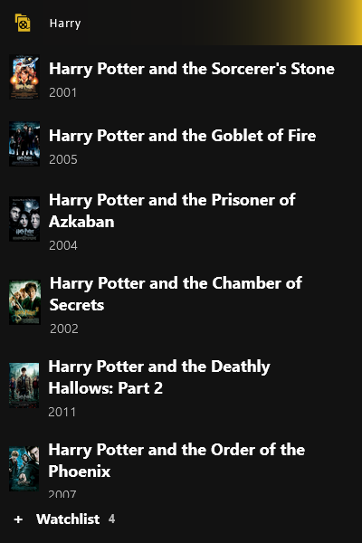
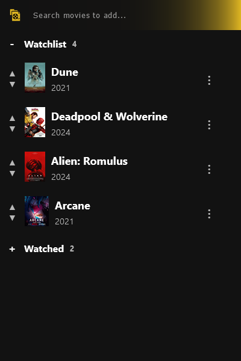

# Movie watchlist
Simple extension, that allows bookmarking movies/series from IMDB listings.  
<p align="center">
    
    
</p>

-----

This README provides step-by-step instructions for setting up and building the `imdb-watchlist` React project.

## Table of Contents

1. [Prerequisites](#prerequisites)
2. [Installation](#installation)
3. [Running the Project](#running-the-project-in-browser)
4. [How to Build](#how-to-build)
5. [Add development build as a local temporary extension](#add-development-build-as-a-local-temporary-extension)
6. [Add development build as a local permanent extension](#add-development-build-as-a-local-permanent-extension)

## Prerequisites

Ensure you have the following installed on your system:

- **Operating System**: Any OS that supports Node.js (Windows, macOS, Linux)
- **Node.js**: Version 14.0.0 or higher
- **npm**: Version 6.0.0 or higher (usually comes with Node.js)

### Node.js and npm Installation

#### Windows/macOS

1. Download the Node.js installer from the [official website](https://nodejs.org/).
2. Run the installer and follow the instructions.

#### Linux

For Debian-based distributions (like Ubuntu):

```sh
sudo apt update
sudo apt install nodejs npm
```  
For other distributions, refer to the official Node.js documentation.

## Installation

Follow these steps to set up the project:  

1. Clone the repository:
```sh
git clone https://github.com/TeemuTallskog/movie-watchlist.git
cd movie-watchlist
```
2. Install dependencies:
```sh
npm install
```

## Running the Project in browser

To start the development server:
```sh
npm start
```

This will run the app in development mode. Open http://localhost:3000 to view it in the browser.

## How to build
Navigate to project root and run:
```cmd
npm run build
```
This generates a `build` directory with all necessary resources.  
All files/directories in the `build` directory need to be compressed into a `.zip` folder.

## Add development build as a local temporary extension

Enter URL `about:debugging#/runtime/this-firefox`  
Press `Load Temporary Add-on...` and select `build/manifest.json`

## Add development build as a local permanent extension

**Prerequisites:**
* If you are using **Firefox Developer Edition** set `xpinstall.signatures.required = "false"` in `about:config`.  

-------- **OR** ---------

* Remove the following line from `build/manifest.json`:  
    ```json
    "browser_specific_settings": {
        "gecko": {
          "id": "movie-watchlist@github.com"
        }
      }
    ```
<br>  

**Finally:**  
Compress all files in `build` directory to a `.zip` file.  
Then navigate to `about:addons` and drag and drop the zip file.